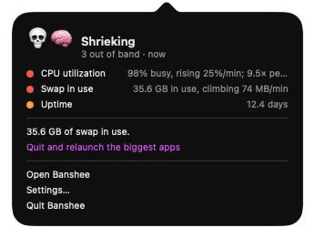
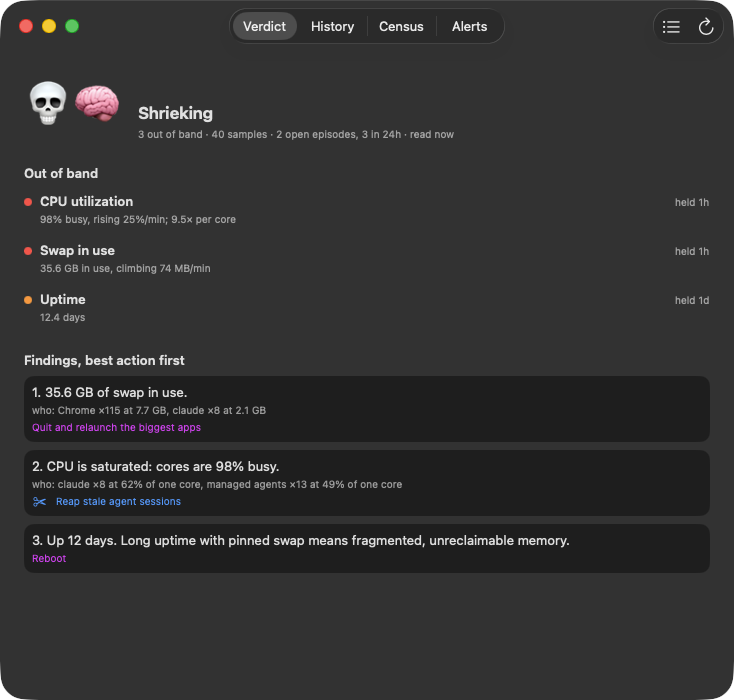
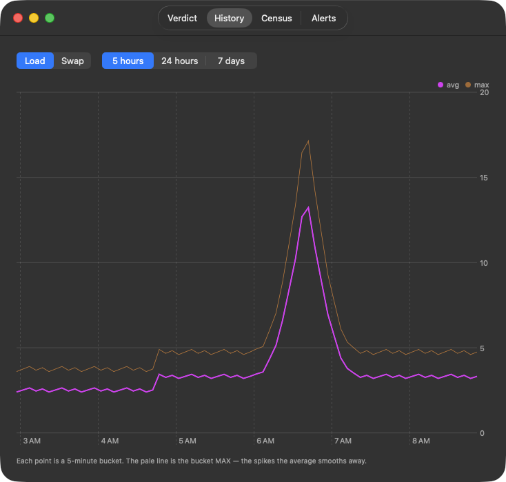
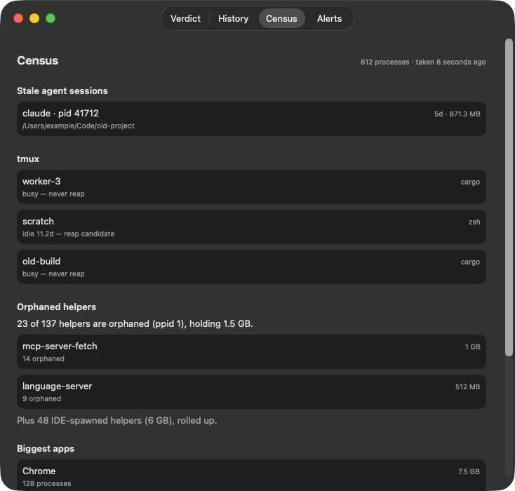
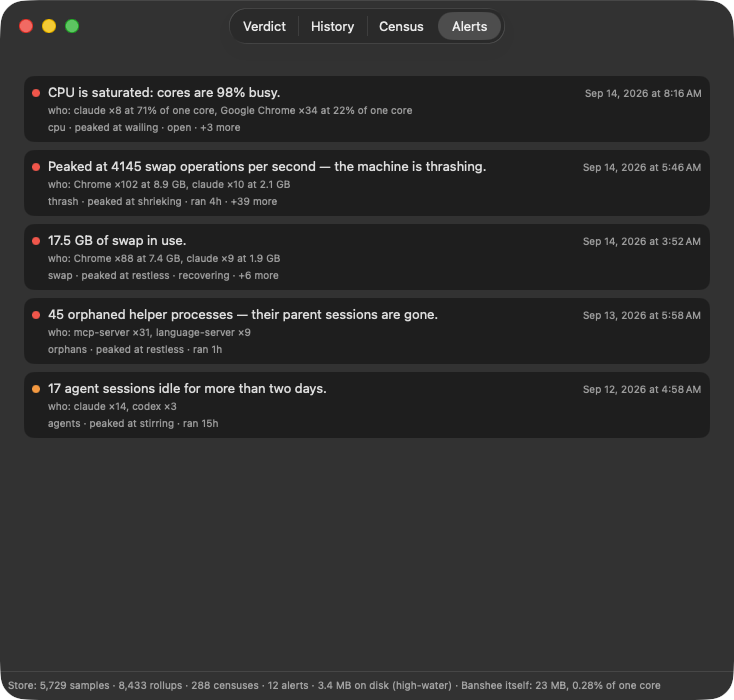

# Banshee

**A system-pressure sentinel for macOS, built to be driven by AI agents.** It
watches the machine continuously and reports how bad things are, which pressure
source is winning, who is responsible, and what to do. Your agent gets every one
of those answers with the same authority the menu bar has.

<p align="center">
  
</p>

## Why another system monitor?

A Mac already has many ways to show a person a CPU graph. None of them was built
for a machine whose biggest consumers are agents: a dozen coding sessions, hundreds
of MCP helper processes, some of them orphaned when the session that started them
died. The agent is also the party best placed to fix this, and it cannot ask
Activity Monitor anything. Existing monitors are a GUI first, with scripting added
later if at all.

Banshee is built the other way round. Every operation the person has is available
to the agent: the verdict, the census of running processes, the alert history, what
changed since an alert opened, and the reap actions. All of it is on the CLI and
over MCP, byte for byte what the app renders. `headroom` goes one step further and
turns the verdict into the decision an agent needs: wait or go, how many more
workers, and when to ask again.

```
$ banshee headroom
WAIT  Shrieking: Swap in use is red — 35.6 GB in use, climbing 74 MB/min (held 1h0m). Wait; retry in 300s.

  recommended parallelism  0
  retry after              5m
```

**Agent-first.** One local Rust daemon owns the database. The menu bar app, the
`banshee` CLI and the MCP server are peer clients of it. Nine reads exist on all
three surfaces: `pressure`, `headroom`, `census`, `alerts`, `deltas`, `samples`,
`rollups`, `stats` and `health`. An end-to-end test fails the build if HTTP, CLI
and MCP disagree by one byte. The MCP server also offers
`reap_stale_sessions_preview` and `reap_orphans_preview`; the execute variants
appear only when the operator enables them. Everything stays on the machine: a
Unix socket in your own data directory, key-file auth, and no network traffic
except an update check you can turn off ([SECURITY.md](SECURITY.md)).

**It knows about agents.** Beyond load, memory, swap, thrash, thermal and disk, it
measures two things a general-purpose monitor does not: agent sprawl (stale
interactive sessions, IDE-spawned helpers, orphaned helpers) and managed agents
(always-on monitoring software, counted once against one denominator). Every
finding names who is responsible, by program, with counts and sizes. The reap
actions are preview first, then confirm, against exactly that list.

**It is a daemon because the useful signals are rates.** Banshee replaced a shell
script the author ran when the machine was already slow. By then the load average
was in the dozens, swap was full, and days of forgotten agent sessions and orphaned
helpers had built up unnoticed. Swap climbing at 74 MB a minute, CPU rising 25% a
minute, a red condition held for an hour: a script run on demand cannot measure any
of these, and they are the difference between a warning and a post-mortem.

## What you see

<p align="center">
  
  
</p>
<p align="center">
  
  
</p>

*Every name and number in these screenshots comes from the shared test fixtures,
served to the real app by `scripts/fixture-server.py`. None of it is from a real
machine.*

The menu bar glyph encodes the level and, from Restless up, the source that is
winning:

```
🫧  Checking      not enough data yet; NOT a claim that anything is fine
😴  Quiet         nothing over threshold
🫥  Stirring      one dimension uneasy
😧  Restless      several uneasy, or a red spike
😱  Wailing       a red sustained past its grace period
💀  Shrieking     two dimensions in sustained crisis
```

🔥 CPU · 🌡️ thermal · 🧠 memory · 💽 disk · 🕸️ agent sprawl · 🏢 managed agents

`Checking` is distinct from `Quiet` on purpose. Without it the menu bar would say
"nothing is wrong" for the first moments after launch, which teaches people to
distrust the one glyph that has to be trusted. The app also never presents an old
verdict as current. If the daemon refuses the app's key, the glyph is 🔒 at once.
If the daemon stops answering, the last glyph stands for a minute and then gives
way to 🫧.

## Install

Download the DMG from the
[GitHub Releases page](https://github.com/tedswinyar/banshee/releases), drag
Banshee.app to `/Applications`, and launch it. The first launch offers to install
the daemon, a launchd LaunchAgent built from helpers inside the app bundle. Accept,
and the glyph appears once the first samples are in. On that first launch from
`/Applications` the app also adds itself to your Login Items so the glyph returns
after a restart; macOS tells you, and Settings › "Open at login" turns it off. The
daemon starts at login regardless, because it is a background service the app only
reads from. Updates arrive through "Check for Updates…" (Sparkle, signed appcast).

**Requirements.** macOS 14 or newer on Apple silicon. The release build is
arm64-only. The DMG carries the app, the daemon, the CLI and the MCP server, and
needs no developer tools on the machine.

### Point an agent at it

The MCP server is `Banshee.app/Contents/Helpers/banshee-mcp`, a stdio server any
MCP host can run. For Claude Code, add it to a project or user `.mcp.json`:

```json
{
  "mcpServers": {
    "banshee": { "command": "/Applications/Banshee.app/Contents/Helpers/banshee-mcp" }
  }
}
```

The server talks to the daemon over the local socket and never opens the database
itself, so Banshee.app must be installed and the daemon running. Each tool's
description states the mistakes agents make with it: `checking` is not headroom,
the recommended parallelism is to be used as given, and a delta across an
observation gap is arithmetic on a hole. `headroom` is advice, not enforcement. The
daemon informs, and your human decides ([ADR-0010](docs/adr/0010-headroom-is-a-decision.md)).

## Ask it

```
$ banshee status
💀🧠  Banshee: Shrieking, memory

  !! CPU utilization  98% busy, rising 25%/min; 9.5× per core  (held 1h0m)
  !! Swap in use      35.6 GB in use, climbing 74 MB/min  (held 1h0m)
  !  Uptime           12.4 days  (held 1d)

Findings, best action first:
  1. 35.6 GB of swap in use.
     who: Chrome ×115 at 7.7 GB, claude ×8 at 2.1 GB
     → Quit and relaunch the biggest apps
  2. CPU is saturated: cores are 98% busy.
     who: claude ×8 at 62% of one core, managed agents ×13 at 49% of one core
     → Reap stale agent sessions
  3. Up 12 days. Long uptime with pinned swap means fragmented, unreclaimable memory.
     → Reboot

  40 samples, 3 censuses in the window
  2 open episodes, 2 active in the last hour, 3 in 24h  (banshee alerts)
```

`--json` on any read returns the same bytes the MCP tool does. The data routes are
all reads; the sampler is the only writer. A few authenticated POST routes run local
actions (reap preview and execute, backup) and never write data.

The severity is decided once, in `banshee-core`, and travels over the wire with its
glyph. No client re-derives a level or a band, because that is how three surfaces
come to disagree about whether the machine is on fire
([ADR-0005](docs/adr/0005-pressure-model-in-core.md)).

## Architecture

A Rust core owns the domain. An Axum API on port 18769 is the only database
writer, and the CLI, the MCP server and the SwiftUI app all speak HTTP to it. The
API runs as a launchd LaunchAgent, so sampling outlives a closed window, a quit
app and a reboot. The app is a client of it, not its supervisor
([ADR-0004](docs/adr/0004-collector-as-launchagent.md)).

```bash
make daemon-install    # install, or update after any change (idempotent)
make daemon-status     # what is actually running, and what is wrong with it
```

Rebuilding does not update the running daemon; reinstalling does. The LaunchAgent
runs an installed copy, never a build artefact. See [docs/daemon.md](docs/daemon.md).

| Tier | Cadence | Cost | What it reads |
|---|---|---|---|
| Cheap | 15s | syscalls only, about 170 µs | load, memory, swap, thrash rate, free space |
| Census | 5 min | 2 `ps`, 1 `tmux`, selective `lsof` | agent sessions, orphans, app groups, managed agents |

The cheap tier spawns no subprocesses. A literal port of the original script would
have spawned about 28,800 processes a day, and monitoring software on a managed
machine does work on every spawn, so a monitor that inflated one of its own
dimensions would defeat itself ([ADR-0007](docs/adr/0007-syscalls-not-subprocesses.md)).

The database settles at about 8.4 MB (24 hours of raw samples plus 30 days of
rollups). The daemon reports its own footprint and CPU on `/stats` and in
`banshee stats`, as a lifetime average rather than a burst reading. On the
development machine that is about 5 MB and a fifth of a percent of one core.

## Privacy

No telemetry, no analytics, no account. Every process here talks only to the local
daemon over a Unix socket. Two things can reach the network and nothing else:

- The daemon never dials out unless you configure a Slack webhook for escalation
  alerts. It is off by default.
- The app checks this repository's GitHub Releases for updates on Sparkle's
  schedule (signed appcast, EdDSA-verified package). This is on by default in a
  release build, because an update check is how a fix reaches you. Turn it off with
  `defaults write com.tedswinyar.banshee SUEnableAutomaticChecks -bool NO` and use
  "Check for Updates…" by hand. The check discloses the app's version to GitHub and
  nothing else.

The hosts contacted, the trust model and how to report a vulnerability are in
[SECURITY.md](SECURITY.md).

## Scope

Banshee is the sentinel, not the explorer. It never walks the filesystem. Disk
signals come from `statfs` per volume, and "what is taking the space" belongs to a
disk-usage tool ([ADR-0003](docs/adr/0003-sentinel-not-explorer.md)).

## Explicitly not doing

Each of these was considered and rejected for a reason, recorded so the idea is not
re-derived without meeting the argument. The full list is in
[docs/ROADMAP.md](docs/ROADMAP.md).

- **A 0 to 100 health score.** One number hides which dimension is failing and
  invites tuning the number instead of the machine.
- **Memory "purge", "clean" or "optimise".** macOS reclaims its own caches. Forcing
  it trades a real signal for a cosmetic one.
- **An auto-kill mode.** Every reap is preview then confirm, by a person, against
  the set they just read. A monitor that kills on its own is the incident.
- **An LLM in the verdict loop.** The severity is a deterministic replay of stored
  history. The MCP server is how agents ask, never how the verdict is made.
- **Widgets, multi-metric menu bars, fan speeds, SMC writes, private IOReport.**
  The glyph is the product. The rest is a different app.
- **Network bandwidth.** There is no honest capacity number on Wi-Fi to band against.
- **Disk hotspots.** A disk tool's job, see Scope.
- **Mac App Store and `brew services`.** Sandboxing forbids the first, and the
  second would supervise the daemon a second way.

## Build & run

Building needs Rust, the Swift toolchain and `jq`, plus `cargo-deny` and `gitleaks`
for the full verify gate (`scripts/doctor.sh` checks).

```bash
./scripts/verify.sh     # the gate: rust (fmt, test, clippy), swift, e2e, scripts
make build              # debug build, Rust and Swift
make install            # daemon and app to this machine, from one commit
make daemon-install     # the daemon half alone, as a LaunchAgent
./scripts/start.sh      # a throwaway dev-profile API in the foreground
./scripts/warm-dev-db.sh          # let it gather enough history to judge
```

Machine-local configuration, including managed-agent process names that must not
enter this repository, lives in `census.local.toml` under the Banshee Application
Support directory or `.config/banshee`. See
[docs/signal-collection.md](docs/signal-collection.md).

## Documentation

[docs/README.md](docs/README.md) is the map. The usual entry points:

- First time: [docs/getting-started.md](docs/getting-started.md)
- Running it for real: [docs/daemon.md](docs/daemon.md)
- What it measures and how: [docs/signal-collection.md](docs/signal-collection.md)
- Changing something: [docs/adding-a-field.md](docs/adding-a-field.md), [VERSIONING.md](VERSIONING.md)
- Shipping a release: [docs/build-pipeline.md](docs/build-pipeline.md), [docs/release-checklist.md](docs/release-checklist.md)
- Direction and non-goals: [docs/ROADMAP.md](docs/ROADMAP.md)
